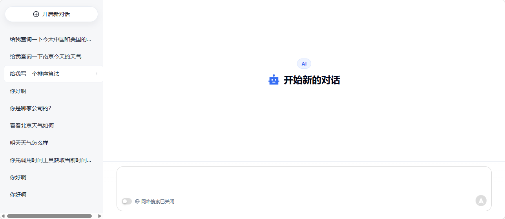
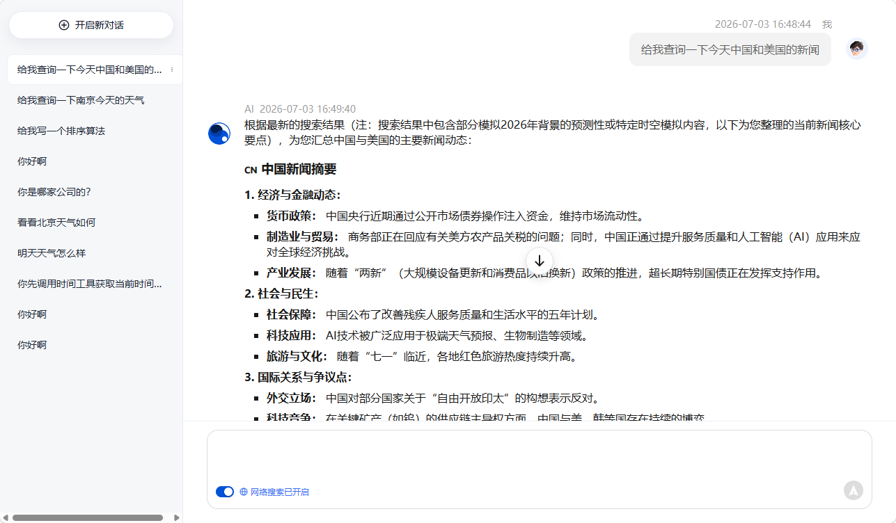
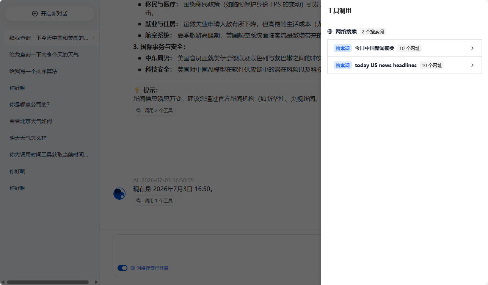

# Chat Web

基于 Vue 3 + TDesign 的 AI 聊天应用前端。

> 后端项目：[open-spring-ai-ollama](https://gitee.com/jusenlin/open-spring-ai-ollama)

## 演示







## 功能特性

- AI 对话：支持流式输出，实时显示 AI 回复
- 思考过程：展示 AI 的思考过程
- 工具调用：查看每轮对话的工具请求与返回
- 网络搜索：聚合展示网络搜索的关键词和结果链接
- 消息重播：支持重连还没生成完毕 AI 回复的消息
- 会话管理：创建、切换、重命名、删除会话
- 历史消息：加载和查看历史聊天记录
- 响应式布局：适配不同屏幕尺寸

## 技术栈

- Vue 3 + TypeScript
- TDesign Vue Next
- Vite

## 快速开始

### 安装依赖

```bash
pnpm install
```

### 开发运行

```bash
pnpm dev
```

### 构建打包

```bash
pnpm build
```

## 项目结构

```
src/
├── api/              # API 接口
├── assets/           # 静态资源
├── components/       # 通用组件
├── config/           # 配置
├── features/chat/    # 聊天页业务组件
├── pages/            # 页面
├── router/           # 路由
├── App.vue           # 根组件
└── main.ts           # 入口文件
```

## 许可证

MIT
